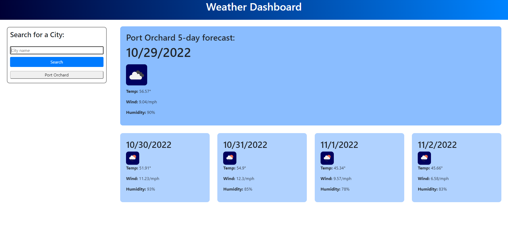

# 06 Server-Side APIs: Weather Dashboard

## Description

This application allows the user to obtain the weather forecast for 5 days in any location. It makes an API call to Open Weather API to obtain this information. 

## Installation

Clone this repo

## Usage

To obtain the weather information, simply enter the city name in the search bar, then click search. The 5-day forecast for that city will appear, and your search will be saved to your search history. To review your previous searches, click on the name of the city you would like to revisit, and that material will be displayed. 

